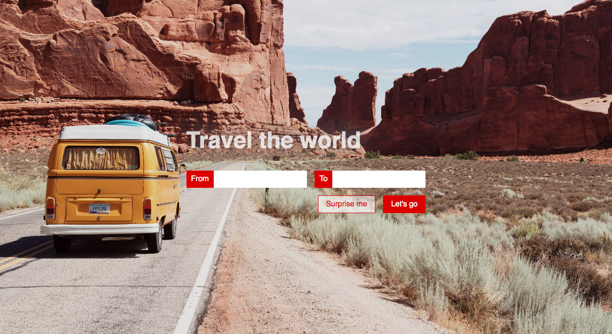

# Travel Destination Form

##My Solution in Live Form
https://rami24t.github.io/TravelDestinationsExerciseFromDCI/

Create a travel from as shown in the mockup below:

#### Specifications

> - 2 fields: from and to
> - on click on the labels, the corresponding field gets focus
> - both buttons have hover effects (color, background changes, > cursor)
> - the form cannot be submitted if there is no text entered in the fields

#### Extra

- make it responsive, items stack on top of each other
- improve text readability
